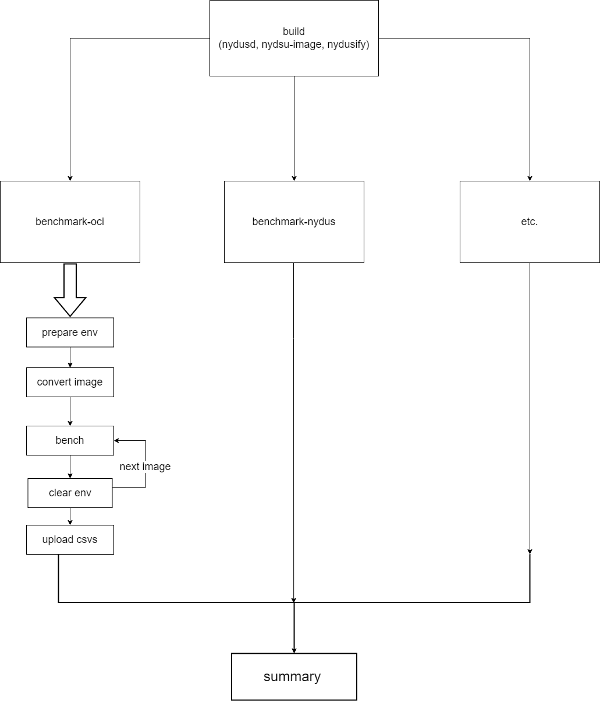

# perweek
- new benchmark.yml for perweek schedule
```yaml
name: Benchmark

on:
  schedule:
    # every Sunday 22:00 clock UTC, Monday 6:00 clock GMT+8
    - cron: '0 22 * * 0'
  workflow_dispatch:
```
# job
- five bench job 
  - benchmark-oci
  - benchmark-nydus-no-prefetch
  - benchmark-zran-no-prefetch
  - benchmark-nydus-all-prefetch
  - benchmark-zran-all-prefetch
  - benchmark-nydus-filelist-prefetch
- one summary job

# more config and images
- change the config.image in config.yaml to list
- add arg path-config.yaml to use different config
- support bench more images by Hello Bench
- support clear cache and restart sanpshotter service to bench more than one image in each job
- if the bench time is too long, maybe use different job for differnet configs, but that maybe need ```nums * 5``` jobs


